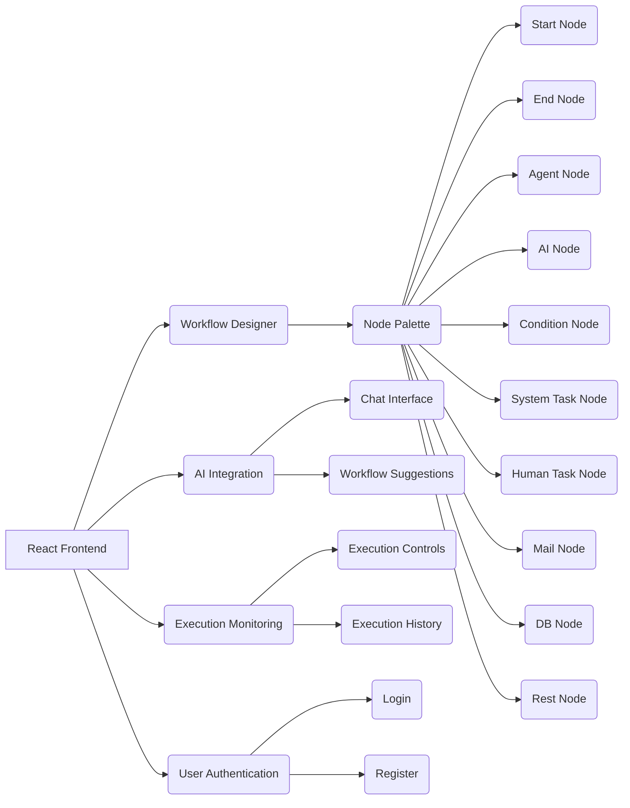

# AI Workflow Frontend

This project is a React-based frontend for managing AI workflows. It provides a user interface for designing, executing, and monitoring AI-driven processes.

## Features

- **Workflow Designer:** A visual designer for creating and editing workflows with a drag-and-drop interface.
    - Node Palette: Provides a set of nodes to design workflows, including:
        - Start Node: Initiates the workflow.
        - End Node: Terminates the workflow.
        - Agent Node: Integrates with AI agents.
        - AI Node: Executes AI-related tasks.
        - Condition Node: Implements conditional logic.
        - System Task Node: Executes system-level tasks.
        - Human Task Node: Allows for human intervention in the workflow.
        - Mail Node: Sends email notifications.
        - DB Node: Interacts with databases.
        - Rest Node: Integrates with REST APIs.
- **AI Integration:** Seamless integration with AI services for intelligent automation.
    - Chat Interface: Allows users to interact with AI models.
    - Workflow Suggestions: Provides AI-powered suggestions for workflow design.
- **Execution Monitoring:** Real-time monitoring of workflow executions.
    - Execution Controls: Provides controls to start, stop, and pause workflow executions.
    - Execution History: Displays a history of workflow executions.
- **User Authentication:** Secure user authentication and authorization.
    - Login: Allows users to log in to the application.
    - Register: Allows users to create new accounts.
- **Activity Management:** Allows users to manage activities.
    - Activity Form: Allows users to create and edit activities.
    - Activity List: Displays a list of available activities.
- **Agent Management:** Allows users to manage AI agents.
    - Agent Form: Allows users to create and edit AI agents.
    - Agent List: Displays a list of available AI agents.
- **Policy Management:** Allows users to manage policies.
    - Policy Editor: Allows users to create and edit policies.
    - Policy List: Displays a list of available policies.
- **Rule Management:** Allows users to manage rules.
    - Rule Editor: Allows users to create and edit rules.
    - Rule List: Displays a list of available rules.
- **Workflow Execution:** Executes workflows and manages human tasks.
    - Human Task Form: Allows users to complete human tasks in the workflow.
- **Workflow Preview:** Allows users to preview the workflow.
- **Workflow Code:** Allows users to view the code representation of the workflow.
- **Tabs:** Designer, Execute, Code, and Preview tabs for different workflow-related tasks.
- **Layout:**
    - Navigation Panel: Provides navigation links.
    - Context Panel: Displays contextual information.
    - Chat Panel: Displays the chat interface.

## Architecture



## Technologies Used

- React
- TypeScript
- Vite
- Zustand

## Getting Started

1.  Clone the repository:

    ```bash
    git clone <repository-url>
    ```
2.  Install dependencies:

    ```bash
    npm install
    ```
3.  Run the development server:

    ```bash
    npm run dev
    ```

## Contributing

Contributions are welcome! Please feel free to submit pull requests.

## License

[MIT](LICENSE)
